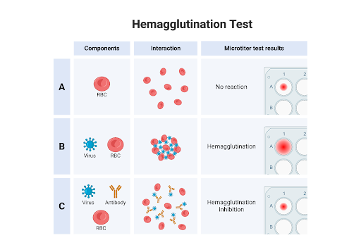

### Theory

The hemagglutination inhibition (HI) assay is used to titrate the antibody response to a viral infection. The assay is based on the ability of the hemagglutinin protein on the surface of the virus to bind to sialic acids on the surface of red blood cells (RBCs).

**Fig. Schematic representation of the haemagglutination inhibition (HI) showing, A. Control B. A negative result (diffuse mat of RBCs), C. A positive result (compact button of RBCs at the bottom of the V-bottom microtiter plate well.**